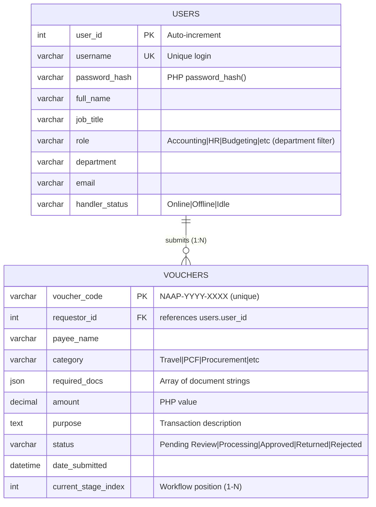

# COMPLETE NAAP Voucher System ERD Diagram

## Database: `naap_voucher_system`

### 🎨 Interactive Mermaid ERD (Copy to [mermaid.live](https://mermaid.live) for visualization)



### 📋 Entity Details

| Table | Purpose | Key Fields |
|-------|---------|------------|
| **users** | System personnel & departments | `user_id` (PK), `username` (UK), `role` (department filter), `full_name`, `email`, `handler_status` |
| **vouchers** | Voucher workflow transactions | `voucher_code` (PK), `requestor_id` (FK), `status`, `amount`, `required_docs` (JSON) |

### 🔗 Relationships
```
users (1) ─────┐
               │ submits
               └───── vouchers (N)
```

- **Cardinality**: One user → Many vouchers
- **Joins**: `vouchers.requestor_id = users.user_id`
- **Filtering**: Non-Accounting users query `WHERE u.role = ?`

### ⚙️ Business Constraints (App-Enforced)
1. **Auto-generated ID**: `voucher_code = "NAAP-" . year() . "-" . rand(1000,9999)`
2. **Initial State**: New vouchers: `status='Pending Review'`, `current_stage_index=1`
3. **Role Permissions**:
   | Role | Visibility |
   |------|------------|
   | Accounting | All vouchers |
   | Other (HR/Budget/etc) | Own `role` only |
4. **Workflow**: Progress via `status` updates & `current_stage_index++`

### 💾 Sample Data Structure

**users**:
```
user_id: 1, username: 'jdoe', role: 'Accounting', full_name: 'John Doe (Accountant)'
user_id: 2, username: 'bsmith', role: 'HR', full_name: 'Jane Smith (HR Officer)'
```

**vouchers**:
```
voucher_code: 'NAAP-2024-5678', requestor_id: 2, status: 'Processing', amount: 15000.00
```

### 🔍 Code-Derived Queries
```sql
-- Dashboard metrics (home.php)
SELECT COUNT(*) as total, SUM(CASE WHEN status IN ('Pending','Processing') THEN 1 ELSE 0 END) as pending 
FROM vouchers v JOIN users u ON v.requestor_id = u.user_id WHERE u.role = ?;

-- Voucher list with join (list.php)
SELECT v.*, u.full_name, u.role FROM vouchers v JOIN users u ON v.requestor_id = u.user_id;
```

**✅ Complete ERD extracted from full codebase analysis (`list.php`, `request.php`, `login.php`, `home.php`, `settings.php`, etc.). Ready for database design/review.**


